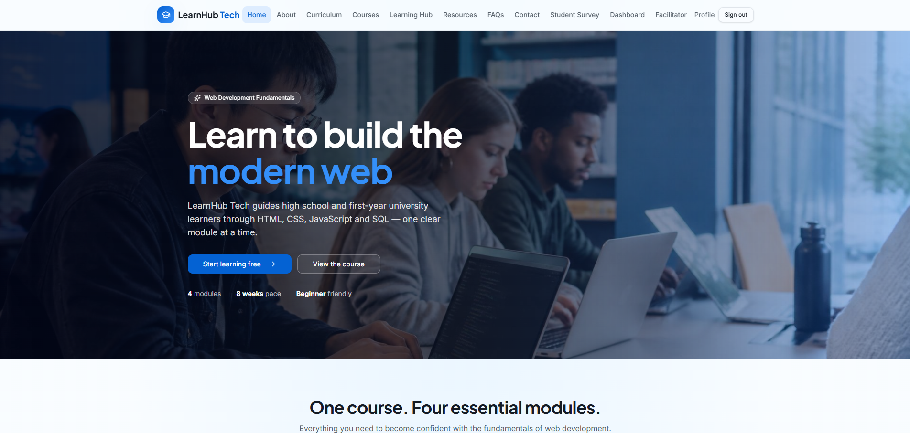

# LearnHub Tech

A modern, responsive online learning platform for high school learners (Grades 10–12) and first-year university students who want to master the fundamentals of web development.



## Project Brief

**LearnHub Tech** delivers a single flagship course — **Web Development Fundamentals** — structured into four beginner-friendly modules:

1. **HTML Fundamentals** — semantic structure and content
2. **CSS Fundamentals** — styling and responsive layout
3. **JavaScript Fundamentals** — interactivity and logic
4. **SQL Fundamentals** — querying and managing data

The design language is clean, modern, and professional (blue, white, and dark grey) with real photography, soft shadows, and consistent typography — inspired by Coursera, Udemy, and freeCodeCamp rather than a children's learning site.

## Target Audience

- Grade 10–12 high school learners
- First-year university students
- Absolute beginners with no prior programming experience

Language is kept simple, technical terms are defined before use, and each concept is supported by examples, code snippets, and short videos.

## Core Features

### For Students
- Sign up / sign in (email + password or Google) as a **Learner**
- Enroll in the course and track progress across modules
- Structured lesson pages with overview, objectives, explanations, code examples, embedded YouTube tutorials, and practice exercises
- 10-question multiple-choice quiz per module with per-question feedback and explanations
- **Final Examination** (40 questions, 45-minute timer, 70% pass mark) unlocked after all modules are complete
- **Course Completed** page with downloadable Certificate of Completion
- Student profile and progress dashboard
- Post-course **Student Survey** for feedback

### For Facilitators
- Dedicated Facilitator panel to create and manage courses, modules, lessons, and quizzes

### For Administrators
- Manage all course content
- View registered students
- Review survey responses and contact messages

### Public Pages
Home · About · Curriculum · Courses · Learning Hub · Resources · FAQs · Contact · Student Survey

## Tech Stack

- **Framework:** TanStack Start (React 19 + Vite 7, SSR-ready)
- **Styling:** Tailwind CSS v4 with a semantic design-token system
- **UI:** shadcn/ui components
- **Backend:** Lovable Cloud (Postgres, Auth, RLS, Storage)
- **Data:** TanStack Query for loading and caching
- **Auth:** Email/password and Google OAuth with role-based access (Learner / Facilitator / Admin)

## Design System

- **Colours:** Blue primary, white surfaces, dark grey text
- **Typography:** Modern display + sans pairing
- **Imagery:** Real photography of students, code, and modern learning spaces
- **Components:** Card-based layouts, soft shadows, subtle gradients, smooth hover transitions
- **Responsive:** Full support for desktop, tablet, and mobile

## Getting Started

```bash
bun install
bun run dev
```

The app runs at `http://localhost:8080`.

## Roles

| Role        | Capabilities                                                        |
| ----------- | ------------------------------------------------------------------- |
| Learner     | Enroll, learn, take quizzes, sit the final exam, earn a certificate |
| Facilitator | Create and manage courses, modules, lessons, and quizzes            |
| Admin       | Full content control, view students, surveys, and messages          |

---

© LearnHub Tech — built with Lovable.
